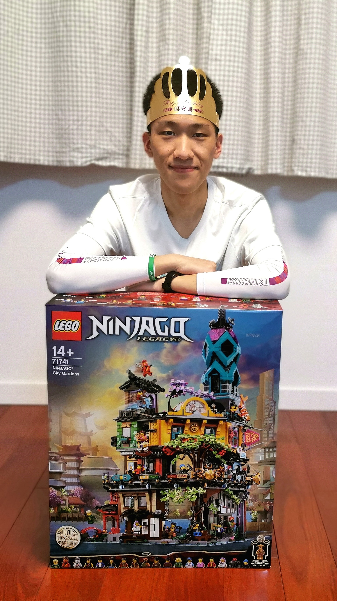

## TIANAO LI 李天骜

Phone: +86 13301296130

Email: lta19@mails.tsinghua.edu.cn

[CV](https://github.com/Lukeli0425/Lukeli0425.github.io/raw/main/Tianao%20Li.pdf) | [GitHub](https://github.com/Lukeli0425/) | [LinkedIn](https://www.linkedin.com/in/tianao-li-596997227/)

## About

<!-- 

    
    I'm an undergraduate student at Department of Electronic Engineering, Tsinghua University. I'm currently working as an intern at Tsinghua Visual Intelligence and Computational Imaging Lab [(Luvision)](http://www.luvision.net) under the directions of Prof. [Lu Fang](http://www.luvision.net/show-684.html). I'm working on building a DDNN system at the moment. I received a high school diploma at Beijing No.4 High School in 2019.

 -->

  <table style="width:100%;border:0px;border-spacing:0px;border-collapse:separate;margin-right:auto;margin-left:auto;"><tbody>
  <table style="border:0px;border-spacing:0px;"><tbody>
  <tr style="padding:0px">
  <td style="padding:0%;width:60%;vertical-align:left">

  <!-- <h1>Tianao Li</h1>
  <h2>About</h2> -->
  

    I'm an undergraduate student at Department of Electronic Engineering, Tsinghua University. I'm currently working as an intern at Tsinghua Visual Intelligence and Computational Imaging Lab [(Luvision)](http://www.luvision.net) under the directions of Prof. [Lu Fang](http://www.luvision.net/show-684.html). I'm working on building a DDNN system at the moment. I received a high school diploma at Beijing No.4 High School in 2019.
  

  <td style="padding:0%;width:80%;vertical-align:right">
  
  </td>
  </tr>
  </table>

## Research Interests

Optics

Computer Vision

Computational Imaging

